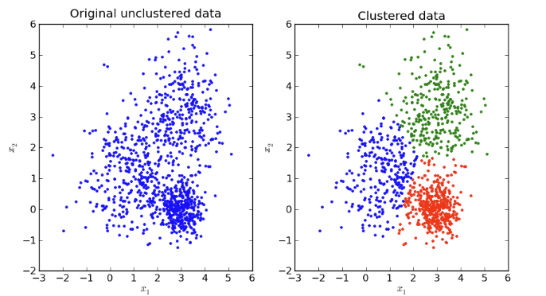

# K-Meansとは  
教師なし学習のクラス分類。ラベルを持ってないデータを扱うときによく用いられる。与えられたデータをグループに分ける

### ユースケース

  - Image Segmentation
  - Clustering Gene Segementation Data
  - News Article Clustering
  - Clustering Languages
  - Species Clustering
  - Anomaly Detection

 参考: https://mubaris.com/posts/kmeans-clustering/

## 手順  

1. クラスタの中心点(セントロイド)をデータの中からランダムにK個選び出す
2. ランダムに配置した中心点から一番近いクラスタにデータを割り当てる
3. 割り当てられたデータを基に、各クラスタに重心を求め、新たな中心点と する
4. クラスタに割り当てるデータの変化がなくなるまで、手順2~3を繰り返す ただし、繰り返し関数がNに達した場合は、その時点で終了する。

  参考: http://tech.nitoyon.com/ja/blog/2009/04/09/kmeans-visualise/